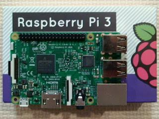
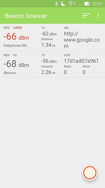
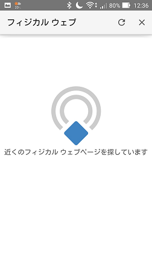
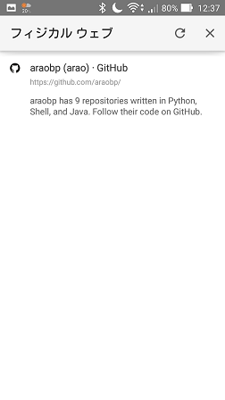
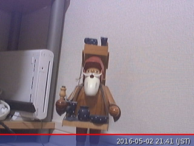

#Beacon

## Project goal

Test iBeacon, Eddystone and WiFi SSID as location tags for smart phones.

## Devices



## Architecture
The Beacon architecture uses AWS for device management and location-specific services:


## iBeacon setup

Refer to https://learn.adafruit.com/downloads/pdf/pibeacon-ibeacon-with-a-raspberry-pi.pdf

## Eddystone setup

### node.js installation

Uninstall the older version of nodejs:
```
$ sudo apt-get --purge remove nodejs
```

Install the latest version:
```
$ curl -sL https://deb.nodesource.com/setup_5.x | sudo -E bash -
$ sudo apt-get install nodejs
```

Refer to https://nodejs.org/en/download/package-manager/#debian-and-ubuntu-based-linux-distributions

### Install eddystone-beacon

```
$ npm install eddystone-beacon
```
Refer to https://github.com/don/node-eddystone-beacon

## Android applications

- [Physical Web](https://play.google.com/store/apps/developer?id=The+Physical+Web+Team)
- [iBeacon and Eddystone Scanner](https://play.google.com/store/apps/details?id=de.flurp.beaconscanner.app)

### Screenshots



## WiFi access point setup

Refer to https://learn.adafruit.com/setting-up-a-raspberry-pi-as-a-wifi-access-point/overview

## AWS setup

[Step 1] Download the SDK, certs and config

Save the config as "config.json".

In my case, I saved all the files in "certs" directory.

[Step 2] Unzip the SDK and try out the examples

```
$ unzip aws-iot-device-sdk-js-latest.zip
$ cd aws-iot-device-sdk-js-latest
$ npm install
$ cd examples
$ node echo-example.js -F ../../certs/config.json -f ../../certs/ -g ap-northeast-1
$ netstat -a | grep 8883
tcp        0      0 192.168.57.132:42235    ec2-54-199-236-168:8883 ESTABLISHED
```

[Step 3] Install aws cli
```
$ sudo pip install awscli
$ aws configure
AWS Access Key ID [None]: XXXXXXXXXXXXXXXXXXXX
AWS Secret Access Key [None]: XXXXXXXXXXXXXXXXXXXXXXXX
Default region name [None]: ap-northeast-1
Default output format [None]: json
```

## AWS IOT test

### device-example.js

Terminal 1
```
$ node device-example.js -F ../../certs/config.json -f ../../certs/ -g ap-northeast-1 --test-mode=1
connect
message topic_1 {"mode2Process":1}
message topic_1 {"mode2Process":2}
message topic_1 {"mode2Process":3}
   :
```

Terminal 2
```
$ node device-example.js -F ../../certs/config.json -f ../../certs/ -g ap-northeast-1 --test-mode=2
connect
message topic_2 {"mode1Process":2}
message topic_2 {"mode1Process":3}
message topic_2 {"mode1Process":4}
   :
```

### thing-example.js

Terminal 1
```
$ node thing-example.js
-F ../../certs/config.json -f ../../certs/ -g ap-northeast-1 --test-mode=1
connected to AWS IoT
delta on: RGBLedLamp{"timestamp":1460904574,"state":{"red":42,"green":143,"blue":10},"metadata":{"red":{"timestamp":1460904574},"green":{"timestamp":1460904574},"blue":{"timestamp":1460904574}}}
delta on: RGBLedLamp{"timestamp":1460904584,"state":{"red":243,"green":216,"blue":65},"metadata":{"red":{"timestamp":1460904584},"green":{"timestamp":1460904584},"blue":{"timestamp":1460904584}}}
```

Terminal 2
```
$ node thing-example.js
-F ../../certs/config.json -f ../../certs/ -g ap-northeast-1 --test-mode=2
connected to AWS IoT
got 'accepted' status on: RGBLedLamp
updated state to thing shadow
got 'accepted' status on: RGBLedLamp
updated state to thing shadow
```

### echo-example.js

Terminal 1
```
$ node echo-example.js
-F ../../certs/config.json -f ../../certs/ -g ap-northeast-1 --thing-name beacon-1
received delta on beacon-1: {"timestamp":1460990590,"state":{"power":"off"},"metadata":{"power":{"timestamp":1460990590}}}
received delta on beacon-1: {"timestamp":1460990629,"state":{"power":"on"},"metadata":{"power":{"timestamp":1460990629}}}
```

Terminal 2
```
$ aws iot-data update-thing-shadow --thing-name beacon-1 --payload '{"state": {"desired" : {"power" : "o
ff"}}}' outfile2.json
$ aws iot-data update-thing-shadow --thing-name beacon-1 --payload '{"state": {"desired" : {"power" : "o
n"}}}' outfile2.json
```

## Working with AWS IOT

Chrome on Adroid already supports Eddystone, so that you don't need to install an extra application for Eddystone.

Next, I work on managing Raspberry-Pi-based Eddystone from AWS IOT.

Note: Eddystone cannot emit URL larger than 18 bytes.

#### Chrome on Android



#### Operation
Terminal 1
```
$ cd ~/beacon/agent
$ ./agent.sh
received delta on beacon-1: {"timestamp":1461036359,"state":{"url":"https://github.com/"},"metadata":{"url":{"timestamp":1461036359}}}
https://github.com/
received delta on beacon-1: {"timestamp":1461036800,"state":{"url":"https://github.com/araobp"},"metadata":{"url":{"timestamp":1461036800}}}
https://github.com/araobp
received delta on beacon-1: {"timestamp":1461036834,"state":{"url":"https://github.com/araobp/beacon"},"metadata":{"url":{"timestamp":1461036834}}}
https://github.com/araobp/beacon
/home/pi/eddystone-beacon/node_modules/eddystone-url-encoding/lib/encode.js:16
    throw new Error([
    ^

Error: Encoded URL (https://github.com/araobp/beacon) is too long (max 18 bytes): 21 bytes
    at module.exports (/home/pi/eddystone-beacon/node_modules/eddystone-url-encoding/lib/encode.js:16:11)
    at Object.makeUrlBuffer (/home/pi/eddystone-beacon/lib/util/advertisement-data.js:39:22)
    at Beacon.advertiseUrl (/home/pi/eddystone-beacon/lib/beacon.js:40:49)
    at ThingShadowsClient.<anonymous> (/home/pi/beacon/agent/agent.js:48:26)
    at emitTwo (events.js:100:13)
    at ThingShadowsClient.emit (events.js:185:7)
    at ThingShadowsClient._handleMessages (/home/pi/aws-iot-device-sdk-js/thing/index.js:227:15)
    at DeviceClient.<anonymous> (/home/pi/aws-iot-device-sdk-js/thing/index.js:313:21)
    at emitThree (events.js:110:13)
    at DeviceClient.emit (events.js:188:7)
```

Terminal 2
```
$ cd ~/beacon/agent
$ node master.js https://github.com/
$ node master.js https://github.com/araobp
$ node master.js https://github.com/araobp/beacon
```

## Webcam on Raspberry Pi

```
$ sudo apt-get install fswebcam
$ fswebcam /tmp/image.jpg
```




